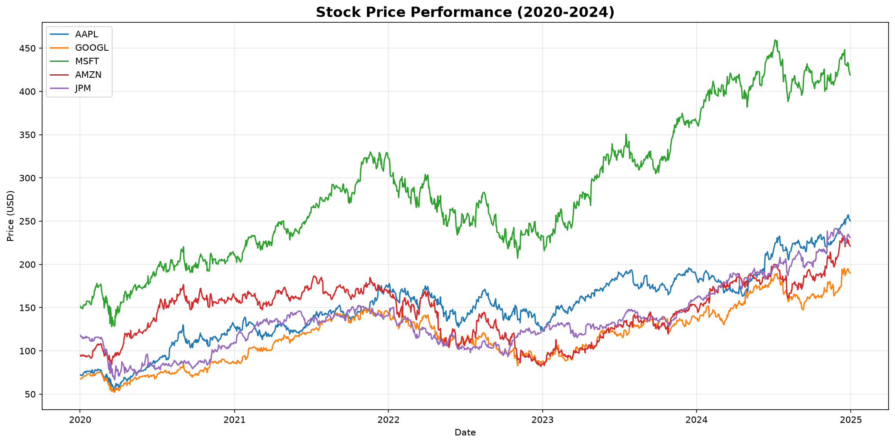
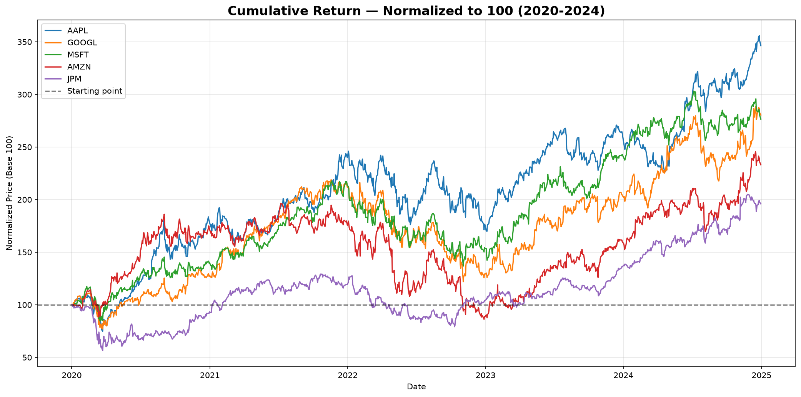
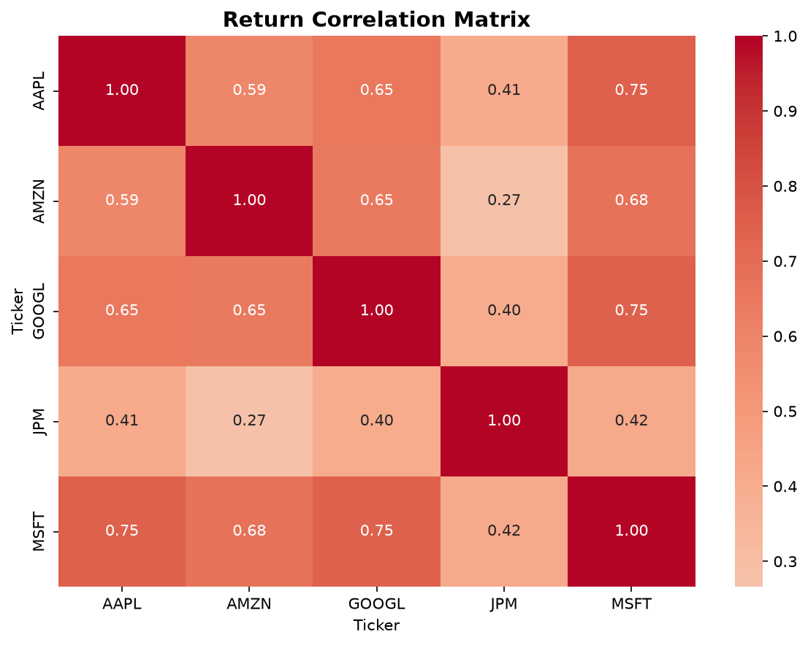
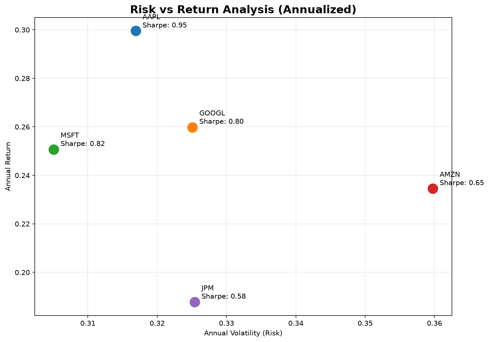

# Investment Portfolio Analysis — Python

## Overview
Quantitative analysis of a 5-stock portfolio (AAPL, MSFT, GOOGL, AMZN, JPM) 
using Python. Covers cumulative returns, volatility, correlation, and 
Sharpe ratio across 5 years of real market data (2020-2024).

## Charts

### Stock Price Performance

### Cumulative Returns (Normalized)

### Correlation Matrix

### Risk vs Return

## Key Insights

1. **AAPL is the top performer** — Sharpe ratio of 0.95, ~250% cumulative 
   return over 5 years with moderate volatility (0.32).

2. **AMZN has the worst risk/return profile** — highest volatility (0.36) 
   with a Sharpe ratio of only 0.65. Fell below starting price in 2022.

3. **Portfolio is overweight tech** — AAPL, MSFT and GOOGL have correlations 
   of 0.65-0.75, meaning they move together and reduce
